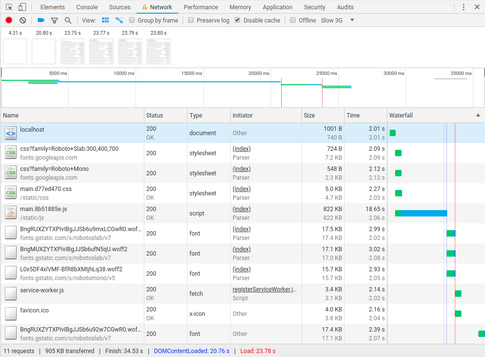
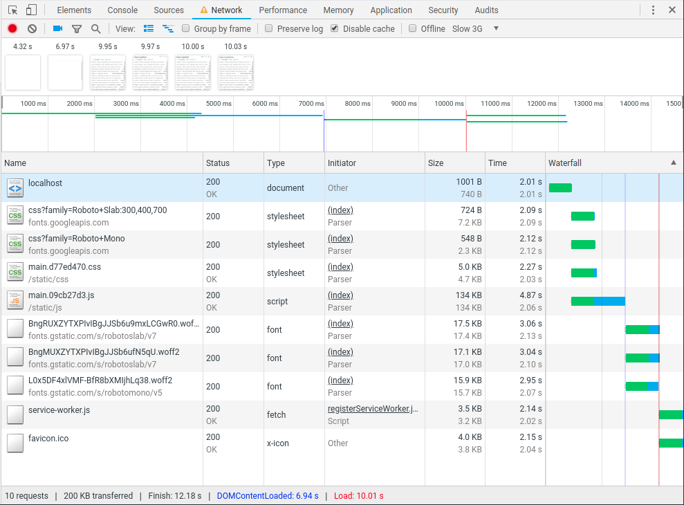

# Optimizing the load time of my website

> [Repo on github](https://github.com/DaniGuardiola/daniguardiola-me/)
>
> Hosted in **daniguardiola.me** (right here :D)
>
> [Full article about my website](./projects/daniguardiola-me)

One of the best ways to significantly improve the user experience is making sure that the webpage is fast and responsive. With a good connection and a fast computer almost any website is fast, no matter how unoptimized it might be, but many **many** times the connection can be poor due to shitty ISPs or spotty mobile networks.

There's a very useful feature on the `network` tab of Chromium's devtools, network throttling, that allows you to simulate different network scenarios (fast or slow 3G, offline or a custom download/upload speed and latency profile) in the webpage. I choose the `slow 3G` preset which, in combination with the `disable cache` and `empty cache and hard reload` options, makes it possible to get accurate data about the whole loading process in an average poor connection and as if the browser had never visited the website before.

With this setup I ran an initial test on a production build:



Woah! 24 seconds to load a simple list of articles! And this screenshot is one of the better ones, let's not talk about the ones in which it takes 50+ seconds... Look at that bundle size, it's almost a whole megabyte: `822kb`. I had to do something about it.

The bundle includes the following content:

- The source code of the website itself
- `react` and `react-dom` packages
- `marked` package for parsing markdown and rendering it in HTML
- `highlight.js` package for parsing code blocks and rendering them stylized in HTML

Of course, it also includes all of the dependencies for each package.

## Code splitting

Code splitting is nothing more than serving your code in chunks and only when needed, asynchronously. It allows the website to load faster because it will only download the code (and modules) it needs to load initially. The rest of it will be downloaded on demand. This can be achieved through [`dynamic import`](https://developers.google.com/web/updates/2017/11/dynamic-import). With standard `import` you load all of the required dependencies every time, like this:

```javascript
import aModule from 'a-module'

const someFunction = () => aModule.doSomething()
```

It doesn't matter if `someFunction` is ever executed, even if `aModule` is not used anywhere else, the module will be loaded every time the application (or in this case, website) starts. Instead, you can load the module only when it is required by using `dynamic import`:

```javascript
const someFunction = () => import('a-module')
  .then(aModule => aModule.doSomething())
```

Of course, `someFunction` becomes asynchronous (`Promise`-returning) and the `async / await` syntax can be used, making life easier for everyone:

```javascript
const someFunction = async () => {
  const aModule = await import('a-module')
  aModule.doSomething()
}
```

[`Dynamic import`](https://github.com/tc39/proposal-dynamic-import) (or `import()`) is in stage 3 of the [TC39](https://tc39.github.io/process-document/) process, but thanks to Webpack and babel, it is possible to use it now for the web, as I'm doing in my website.

Now that you know what code splitting and the `dynamic import` are, let's take a look at what could be made with my code... Well, all of the markdown and code highlighting stuff is only needed when an article is being loaded, so let's lazy load it. The responsible for requesting and parsing the markdown files is the method `get()` of the `Article` component, and it is already asynchronous as it involves a network request, so let's try moving the imports there. This is how it looks now (simplified):

```javascript
async get (article) {
  // create and execute the request, then get the body as text
  const request = new Request(`/data-${article}.md`)
  const response = await fetch(request)
  const text = await response.text()

  // dynamically require the marked and highlight.js libs
  const marked = await import('marked')
  const highlightjs = await import('highlight.js')
  marked.setOptions({
    highlight: (code, lang) => highlightjs.highlight(lang, code).value
  })

  // parse and render markdown
  const result = marked(text)
  return result
}
```

After re-building the project, this is the result of the network test:



That's a different story! Now the main bundle weights just `134kb`, and the website loads in roughly 10 seconds. Not bad for a slow 3G connection! And as soon as I click on any article, the `marked` and `highlight.js` bundles download, just when I needed them.

This was already a great improvement (50%+), but I felt like I could still do more. It is nice that the initial webpage doesn't need the libraries to load, but then whenever I want to load an article I still need to wait to get the libraries I need before anything shows up on screen, even if the webpage has been idle for 2 hours. That doesn't seem right, the goal of code splitting was to make the initial load faster, not to make the website feel irresponsive. This brings me to the next point.

## Pre-loading

Once the page is loaded (completely loaded and responsive), there's no reason to hold back any additional network requests, even for code that is not yet needed. For this reason, I decided to try and pre-load the markdown and code highlighting libs as soon as the website loads. Thanks to `dynamic import`, I was able to implement it in my `index.js` easy and quick:

```javascript
window.addEventListener('load', () => {
  import('marked')
  import('./lib/highlight.pack')
})
```

Of course, this barely has any appreciable effect if the user clicks on an article as soon as the list loads, or if they navigate directly into an article on first load, but it does help when the user navigates for some seconds through a list before opening an article, and I suspect that will usually be the case.

Indeed, after manually testing it for a while, it does improve the user experience, as the articles now only take as long to load as the article request itself takes to complete, if the user has previously navigated a list for a few seconds.

This was another succesful optimization, but something was not right with the bundle sizes, so I took a deeper look into it and I found a nasty surprise.

## Removing unused code (duh)

After taking a deeper look at the bundle contents I discovered that the `highlight.js` module was huge, as it contained every single language supported. That was an oversigh on my part, and it had an easy solution: creating my own bundle of the library with only the languages I need from [their website](https://highlightjs.org/download/) and copying it into the project, instead of using the NPM package.

I didn't write down the previous size of the bundle, but the `highlight.js` part of it got reduced into about `30kb`, which I believe is more than `1000%` smaller. That's a huge improvement in size, and the tests proved it to be much faster.

> Note: I had to modify the library [in a kind of dirty way](https://github.com/highlightjs/highlight.js/issues/1245#issuecomment-242865524), but it works fine

## Pre-rendering markdown

This one's a TODO, but at some point I would like to just pre-render the articles' HTML code with a script and serve it like that directly to the client. This includes the markdown, the code highlighting and any potential extensions of the parser. This offloads the network and some of the work from the client. Also, it ironically renders useless all of the code splitting and preloading stuff.

## Pre-rendering React

Another TODO. Simple enough: serve the rendered HTML along with the CSS styles directly so that the load is almost instantaneous (although it will still take a while for the website to be responsive, as the react code needs to download and initialize).

## The cherry on top: indicating loading state

When something is loading, an empty interface can be experienced as confusing and frustrating, so it is critical to make sure that the user knows what going on and to give them a sense of motion, let them know that everything is running smoothly and they just need to wait for some content to load.

This is what loading screens and animations are for.

TODO!!!!!!!!!!