> **TL;DR, check it out:** [daniguardio.la](https://daniguardio.la/)

# My new... new website

Back in September, I created the previous version of my website, which I published on `daniguardiola.me` with only a couple of articles on the blog.

Although I was moderately happy with it, I didn't have time to polish it, and it was lacking some really basic features like... blog post dates.

Fast-forward to last month (December 2020), I had finally found some time to finally focus on it, and I'd also recently discovered a couple of things I wanted to try: [Next.js](https://nextjs.org/) and [TailwindCSS](https://tailwindcss.com/).

I decided to scrap that version altogether and build it from scratch using both of these technologies. I even had an unpublished partial refactor in which I moved some of the React logic into hooks and used shiny cool libraries, but both Next.js and Tailwind tempted me into starting from scratch. And so I did!

# My old old websites

I've created many websites since I was very young. I used to mess around with Frontpage (an extinct [WYSIWYG](https://en.wikipedia.org/wiki/WYSIWYG) webpage editor) on a dusty Windows 98 machine. At some point, someone gifted me a book about HTML. I remember looking at the generated code trying to understand the tag soup.

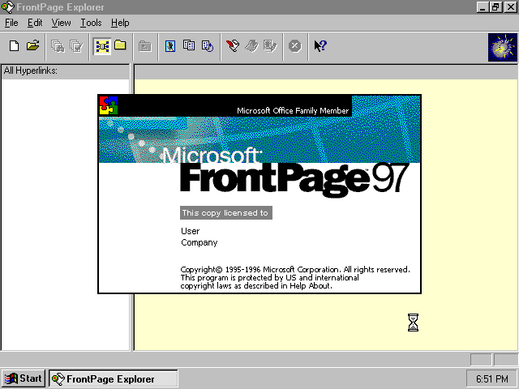

I created a few different websites and blogs in the following years that I would abandon after a while.

The first attempt to create an actual website came after I turned 18. I had my first development job, so I decided to build an online portfolio. I bought the (now defunct) `daniguardiola.me` domain and built a simple single-page portfolio based on a cool template I found.

After some time I made another attempt, this time using vanilla Javascript, HTML, and CSS with a few Polymer components here and there. I had a clear idea of what I wanted: some nice parallax and colorful menus.

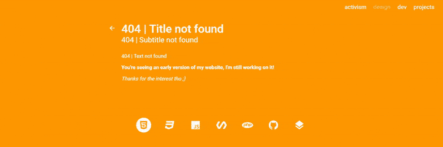

I didn't get to finish this one, but [those ripples look good](https://gist.github.com/DaniGuardiola/c4c623e58dee2a324900), huh?

Years later (last September), I made the version that I've already talked about in the first section. And then I made my current website. Now you're up to date!

# How it's built

The website is built with some cool tech I like:

- [Next.js](https://nextjs.org/): handles site-wide logic, like static generation and routing. [Jamstack](https://jamstack.org/) FTW!
- [React](https://reactjs.org/): does this need a description at this point?
- [TypeScript](https://www.typescriptlang.org/): typed JavaScript superset.
- [TailwindCSS](https://tailwindcss.com/): utility first CSS framework. Can't go back to standard CSS now.
- [MDX](https://mdxjs.com/): Markdown meets JSX.

In the following weeks, I'll be publishing some focused and detailed articles about certain parts of my website. Stay tuned!

# How I deployed it

The site is hosted on [Vercel](https://vercel.com/), a Jamstack-focused platform from the creators of Next.js. That makes everything work smoothly, and integration with the GitHub repo is incredibly easy for continuous deployment, with almost zero configuration. I also manage all my domains from there now, as I've found it to be the simplest registrar I've ever worked with. I was very impressed with it!

Previously, I was manually hosting my websites and webapps on a VPS with a bunch of custom scripts that kept them up-to-date with their repos, and I also had to manage things like the DNS records, TLS certificates and the nginx proxy configuration.

# New new personal brand!

Along with my new website, I tried to make all of my social network profiles a little consistent to establish some sort of "personal brand" looking forward.

## Names

For consistency, I changed my usernames on various platforms to the closest thing to "Dani Guardiola" or, at least, "daniguardio.la" that I could find:

- On [Twitter](https://twitter.com/daniguardio_la), this meant switching from "@daniguardiolame" to "@daniguardio_la".
- On [Instagram](https://instagram.com/daniguardio.la), which allows dots on the account names, I was able to switch from "@daniguardiola.me" to "@daniguardio.la".
- I was already using "DaniGuardiola" in other networks such as [DEV](https://dev.to/daniguardiola), [Medium](https://medium.com/@DaniGuardiola) and [GitHub](https://github.com/DaniGuardiola), so no change was needed there.

## Tagline

I also came up with sort of a tagline. A while ago, I learned about a quote [falsely](https://www.writersdigest.com/be-inspired/did-hemingway-say-write-drunk-edit-sober-nope-he-preferred-to-write-sober) attributed to Ernest Hemingway:

> "Write drunk, edit sober."

Back then, this quote inspired me to work on a self-destructing text editor that doesn't allow you to edit. In fact, I am working on a new version which I have named "writedrunk".

I am very attracted to this quote and its meaning. I find it fascinating. When I work on creative projects, I often find myself trying to perfect everything I do at every step, which hurts my creative process as I focus on perfection instead of creation.

And don't get me wrong: attention to detail is very important. However, the concept of focusing on creation as something that "flows out of your mind" instead of something that has to be perfect from the start is liberating and inspiring. There's always time to come back later and revisit your work.

My craft, however, is not writing, but coding. A sort of translation that I came up with is:

> "Code drunk, refactor sober."

This quote became my tagline for two main reasons: because of the meaning it has, explained above, and because I find it sort of funny, and I don't like to take things more seriously than they need to. Life is mostly a joke so I might as well laugh!

## Looks

Finally, I needed some sort of graphic "guidelines" as part of my personal brand. Of course, we're still talking about me, and I'm only a person. I don't really need anything formal or extensive, unlike what a company or large platform might need. So I kept it simple.

Here are some of the things that I decided would be part of my brand:

- The dark green color, which I copied from Tailwind's `green-900`: `#064e3b`.

  

- The Roboto Slab font.

  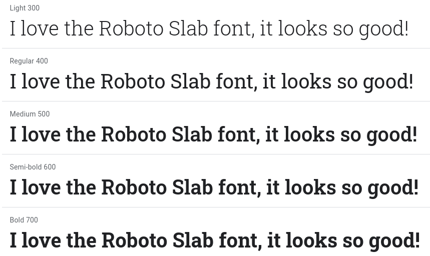

- The Roboto Mono font.

  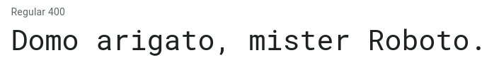

- The typewriter/cursor decoration.

  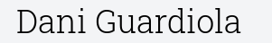

## Results!

Here are a few pictures of how my website and social profiles look, following these rules I established for myself:

### Blog and website

> [daniguardio.la](https://daniguardio.la)

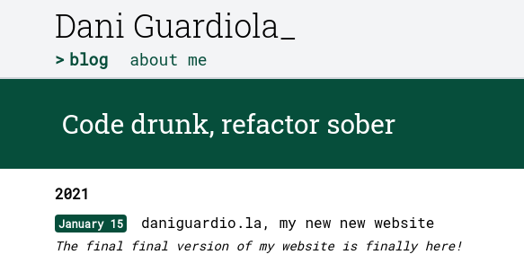

### Social sharing previews

These images are examples of what is shown on social networks when a page or post from my website is shared. In other, more technical words, these are the [Open Graph](https://ogp.me/) images for these pages.

#### Blog image

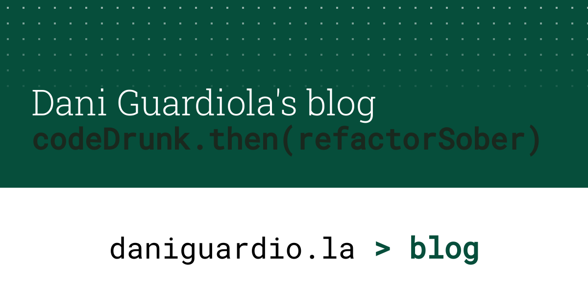

#### About me image

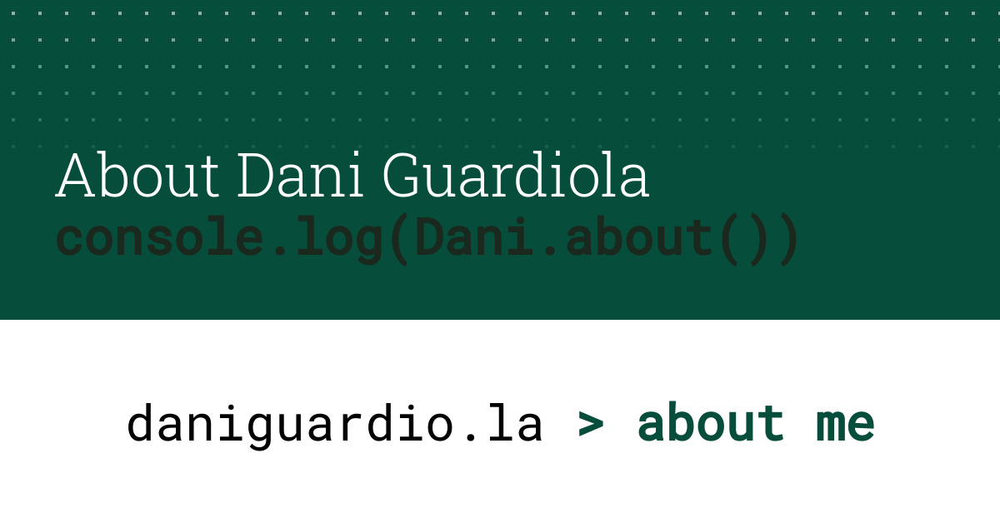

#### Blog post image

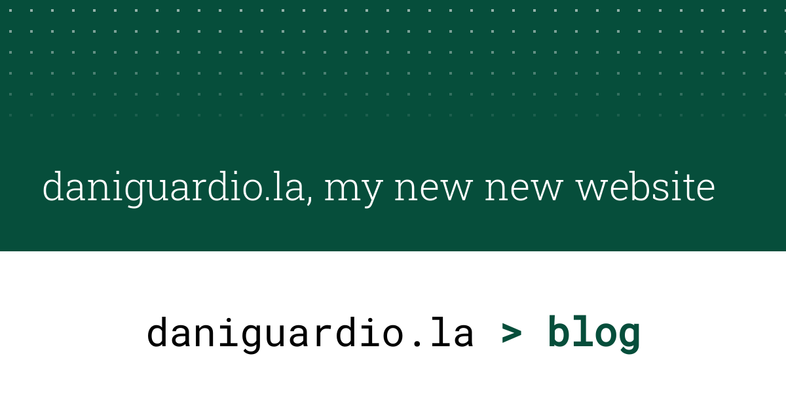

### Twitter

> [@daniguardio_la](https://twitter.com/daniguardio_la)

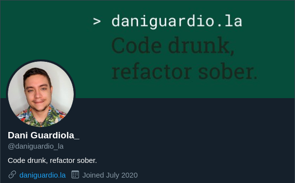

### Instagram

> [@daniguardio.la](https://instagram.com/daniguardio.la/)

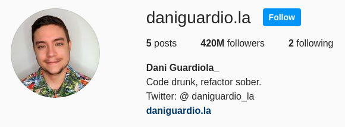

### GitHub

> [DaniGuardiola](https://github.com/DaniGuardiola)

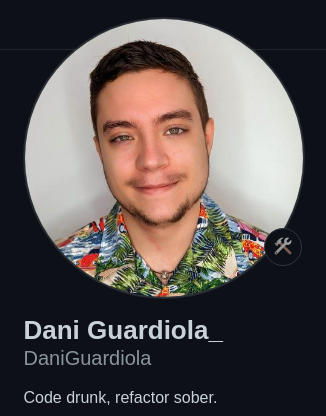

### DEV

> [daniguardiola](https://dev.to/daniguardiola)

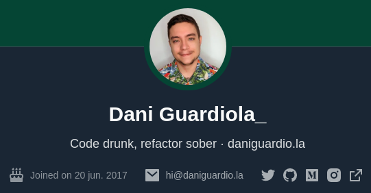

### Medium

> [@DaniGuardiola](https://medium.com/@DaniGuardiola)

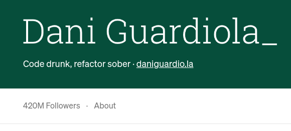

---

Hope you like it! Hit me up on Twitter if you have any feedback ❤️

I will be publishing articles about all sorts of different topics in the future. Follow me on social networks to stay up to date!
