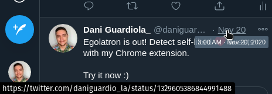
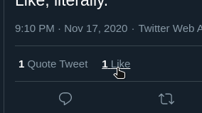

[](https://chrome.google.com/webstore/detail/egolatron/gncgbgdmioamlfdcliheeepnmgknlekm)

[](https://github.com/DaniGuardiola/egolatron)

> **Egolatry**
>
> The worship of the Ego.
>
> _My impulses are the real god that I must follow as it is the only persistent and real influence on me, My Ego is my God, I am a follower of Egolatry._
>
> \- [Urban Dictionary](https://www.urbandictionary.com/define.php?term=Egolatry)

# Self-love

I've always found the idea of liking your own posts funny. I don't have anything against loving oneself, but it's still funny.

In fact, I might have done it myself in the past, but in a more... sneaky way: I used to like my main account tweets from my hidden account so that no one could find out. I'm not the one who's gonna judge.


However, I still wanted to find those self-liked tweets, so I decided to create a web extension that does exactly that! I called it **Egolatron**.

# The strategy

To create such an extension, we need to come up with a few things, including:

- A way to detect tweets loaded into the DOM by the Twitter client.
- A way to extract the tweet IDs and authors from the tweet elements.
- A way to get the list of users who liked those tweets (to check if the author is among them).
- Cool styles 😎 for self-liked tweets.
- A way to apply those styles.

The obvious part is that we're gonna need to load our script inside opened Twitter tabs. That's easily achieved with an [extension content script](https://developer.mozilla.org/en-US/docs/Mozilla/Add-ons/WebExtensions/Content_scripts). We just need to declare it in the [manifest](https://developer.mozilla.org/en-US/docs/Mozilla/Add-ons/WebExtensions/manifest.json):

```json
{
  "content_scripts": [
    {
      "matches": ["https://twitter.com/*"],
      "js": ["content-script.js"]
    }
  ]
}
```

Then, the basic workflow is the following:

1. Detect new tweets.
2. Analyze them to find out if they're self-liked.
3. When self-liked tweets are visible on the screen, render the styles.

# Implementation

> You can check the full implementation [here](https://github.com/DaniGuardiola/egolatron/blob/main/extension/content-script.js) (it's open source!). These are only some simplified fragments that I think are worth sharing, but they are mostly pseudo-code.

## Detecting tweets

There are many ways to go about this, but I didn't want to make things complicated, so I opted for a simple (but far from perfect approach).

Here are two important facts I found about DOM tweets:

- They are `<article>` elements.
- They all contain a link to the tweet itself that looks like this:

  `https://twitter.com/<author>/status/<id>`

  This link is often the tweet date:

  

With this information, I coded a function that detects them:

```javascript
function getDOMTweets () {
  // get all article elements, as they are potential tweets
  const tweetEls = [...document.querySelectorAll('article')]
  return tweetEls
    .map(element => {
      // obtain all links inside the article element
      const links = [...element.querySelectorAll('a')]
      let match
      links.forEach(function (link) {
        // tweets contain at least one link matching this regexp pattern,
        // which also captures the username and tweet ID
        const pattern = /^https:\/\/twitter\.com\/([a-zA-Z0-9_]+)\/status\/([0-9]+)\/?$/
        match = link.href.match(pattern) || match
      })
      if (!match) return // no match, this is not a tweet
      const user = match[1] // first capture group contains the username
      const id = match[2] // second capture group contains the tweet ID
      return { user, id, element }
    })
    .filter(item => item) // filter out non-tweets
}
```

This function will return all detected tweets in the form of an array of `{ user, id, element }` objects.

To keep the list of tweets up-to-date, we need to execute this periodically in a loop:

```javascript
async function updateTweetsLoop () {
  // obtain the tweets from DOM
  const domTweets = getDOMTweets()
  // "update" each tweet found
  domTweets.forEach(updateTweet)
  // recursively call this function again in 200 ms
  setTimeout(() => updateTweetsLoop(100), 100)
}

function updateTweet (tweetData) {
  // do stuff...
}
```

## Analyzing tweets

Now that we have the tweets, we need to check if they've been self-liked.

The straightforward way to achieve this is by retrieving the list of users who liked a certain tweet, and looking for the author on it.

We can find out about this API call by using the ["Network" tab from the DevTools](https://developers.google.com/web/tools/chrome-devtools/network):

1. Open the DevTools panel and go to the "Network" tab.
2. Trigger the API call by opening the like list of a tweet.
   
3. Inspect the request using the DevTools.

Now we have all the information we need to use the API for our evil purposes 😈.

```javascript
function updateTweet (tweetData) {
  checkIfSelfLiked(tweetData)
}
```

Of course, the `updateTweet` function is called from inside the loop, which is executed constantly. We don't want our script to make a bazillion API calls, so we need to check if it has already been checked:

```javascript
function updateTweet (tweetData) {
  if (isNewTweet(tweetData)) {
    checkIfSelfLiked(tweetData)
  }
}
```

When the check is done, we will store the result in memory to use it later.

## Cool styles 😎

I thought it'd be fun to style self-liked tweets in a cool and funny way.

I wanted to give those tweets a "medal", so I made this SVG of a medal using Inkscape:


Then, whenever a self-lifed tweet was visible, I inyected it into the element and added a class for additional styles:

```javascript
function renderSelfLiked (tweetElement) {
  tweetElement.element.insertAdjacentHTML('beforeend', SVG_MEDAL)
  tweetElement.classList.add('self-liked')
}
```

The additional styles take care of three important things:

- Animate the medal dropping initially
- Animate the swinging of the medal
- Add a top red border to the tweet

These CSS styles look like this:

```css
.self-liked {
  border-top: solid red 4px;
}

.self-liked svg {
  top: -20px;
  animation-duration: 0.5s, 2s;
  animation-name: medal_drop, medal_swing;
  animation-iteration-count: 1, infinite;
}
@keyframes medal_drop {
  0% {
    top: -95px;
  }
  100% {
    top: 0;
  }
}
@keyframes medal_swing {
  0% {
    transform: rotate(-4deg) translateX(4px);
  }
  50% {
    transform: rotate(4deg) translateX(-4px);
  }
  100% {
    transform: rotate(-4deg) translateX(4px);
  }
}
```

- The `medal_drop` animation happens once (at the beginning) because it has an `animation-iteration-count` value of `1`.
- The `medal_swing` animation repeats infinitely because it has an `animation-iteration-count` value of `infinite`.

## Applying the cool styles

The `updateTweet` now needs to render these styles for self-liked tweets:

```javascript
function updateTweet (tweetData) {
  if (isNewTweet(tweetData)) {
    checkIfSelfLiked(tweetData)
  } else if (isSelfLiked(tweetData)) {
    renderSelfLiked(tweetData.element)
  }
}
```

Additionally, I wanted these styles to render only once the tweet is fully visible (inside the viewport of the browser). We can assert that with a function like this:

```javascript
function isElementVisible (element) {
  const rect = element.getBoundingClientRect()
  return rect.top >= 0 && rect.bottom <= window.innerHeight
}
```

The `.getBoundingClientRect()` function will give us the position of the element (we need `top` and `bottom`). We can then do the following checks:

- The top of the element is below the top of the viewport (zero or more).
- The bottom of the element is above the bottom of the viewport (less than `window.innerHeight`, which is the height of the viewport).

If both are true, then the element is fully visible.

# Get Egolatron!

<Tweet
  id='1328806906928967681'
  placeholder='Have you ever liked your own tweet?\n\nWell, I built a browser extension that detects self-likes.\n\nI call it "Egolatron". Coming soon to the Chrome Web Store.'
  userId='daniguardio_la'
  userName='Dani Guardiola_'
  date='2020-11-17'
/>

[](https://chrome.google.com/webstore/detail/egolatron/gncgbgdmioamlfdcliheeepnmgknlekm)

[](https://github.com/DaniGuardiola/egolatron)
