> **Too long, didn't read?**
>
> This article describes a series of vulnerabilities and exploits that I found to circumvent regex URL validation.
>
> Jump straight to the exploits:
>
> - [#1 - The dot exploit](#1---the-dot-exploit)
> - [#2 - The escaping exploit](#2---the-escaping-exploit)
> - [#3 - The subdomain exploit](#3---the-subdomain-exploit)
>
> You will probably need to scroll up a bit to get more context on the vulnerabilities that make these exploits possible.
>
> Also check out how to protect a RegExp against them:
>
> - [The secure RegExp](#the-secure-regexp)

# Why I dislike LinkedIn

<Tweet
  id='1286579070717878273'
  placeholder="I don't like LinkedIn."
  userId='daniguardio_la'
  userName='Dani Guardiola'
  date='2020-07-24'
/>

Its interface is ugly, slow, and confusing. Or at least it was, I haven't checked in a while. However, that is not my main issue with it.

The thing that keeps me away from it is its culture. I don't intend to over-generalize, of course, but I find it very superficial and shallow. The last time I used it (long ago), it was just so full of buzzwords, "experts" and "knowledge" that I got dizzy. I didn't even know what was real anymore.

<Tweet
  id='1286579072106205189'
  placeholder='Too many lies, too much professionally disguised incompetence.'
  userId='daniguardio_la'
  userName='Dani Guardiola'
  date='2020-07-24'
  disableConversation={true}
/>

## Yes, yes, I get it

Don't get me wrong. I get it.

It is like Whatsapp: it sucks, it is owned by a privacy-invading company and there are many alternatives out there that are a hundred times better.

_But everyone's on there, so you might as well be on it too._

So yes, I am aware that for many people having a Linkedin profile is sort of a mandatory thing. You need a good profile to get recruiters to call you. It is the place people are gonna go first when looking you up career-wise.

## It still sucks

However, at the same time, being a guy that's interested in _actually_ learning his stuff and -as sort of a direct consequence of this- knowing how little I know about things, I just can't bring myself to enjoy a platform full of "blockchain experts" that can barely spell "hash". And this is an actual, IRL example.

Here's the thing: I wouldn't dare to call myself a Blockchain expert even though I've been learning and working full-time on blockchain technology for the past two and a half years. I spent most of this time designing a custom blockchain platform for the military, and leading a development team to make it a reality.

**And I still don't know the first thing about blockchain.**

<Tweet
  id='1286650256424402946'
  placeholder={
    'Yeah... I\'ve met a few LinkedIn "blockchain experts" in real life and they are barely able to grasp the concept of a hash.'
  }
  userId='daniguardio_la'
  userName='Dani Guardiola'
  date='2020-07-24'
/>

So it shouldn't be surprising that I cringe hard when I see some middle-management dude (that hasn't worked with anything other than Microsoft Powerpoint for years) proudly add the "blockchain expert" title to his LinkedIn profile after attending a (most likely misinformed) 4-hour business-oriented blockchain course.

# No LinkedIn? No job!

At some point in the past, due to this aversion of mine, I ended up completely deleting my LinkedIn profile. It was terribly outdated anyway. My official title on it was "senior lemon eater", which I copied from someone else.

Whenever I wanted to look for a job, my strategy didn't involve LinkedIn at all. I just relied on the good ol' résumé, a simple PDF file with all relevant stuff about me on it.

This worked great for the most part... Until I tried to create a profile on a recruiting platform.

The process involved filling up your profile data, including your social profiles, your personal website, and more. All of it optional. One of these fields was for a LinkedIn profile which I left empty. But then I tried to submit my CV and... well... there was no place in which I could submit it. And this was a problem.

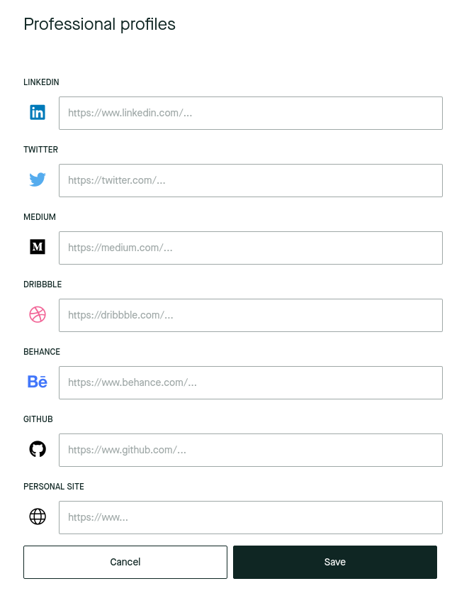

Turns out that recruiters in this platform rely exclusively on LinkedIn profiles to find out basic career information about potential candidates. But I had no LinkedIn, nor any intention to have one. I had already occupied the "personal site" slot with my, you know, _personal site_.

I tried to just put a link to my CV on the LinkedIn field, but no dice. It was being validated. Note the red outline.


# No LinkedIn? No problem!

Now, the validation was happening server-side, so I didn't have access to the validation code, but I knew it was most likely a RegExp pattern.

> "RegExp" and "regex" are abbreviations for ["regular expression"](https://en.wikipedia.org/wiki/Regular_expression), which is a way of defining search patterns for strings. In this case, it is being used to "search" for a LinkedIn URL. If the search is not successful, then the value is deemed invalid. This is a widely used validation technique for text-based input.

Knowing this, and filled with determination to avoid LinkedIn at all costs, I had the idea of bypassing this validation somehow.


I started by trying to break it with non-LinkedIn URLs directly on the page. These are some of the URLs that I tried:

- `https://someurl.com#linkedin.com/`
- `https://someurl.com?.linkedin.com/`
- `https://linkedin.com.someurl.com/`

These are attempts at fooling the validation by creating a LinkedIn-like URL that actually points to the `someurl.com` domain.

In the first two, I was trying to use "escaping" characters such as `?` (used for query parameters) and `#` (used for anchor links). In the last one, I was trying to use a subdomain, hoping that the final `/` character was not being matched.

However, none of these worked.

## Replicating the RegExp

My next step was to come up with my own RegExp to try and recreate theirs. I headed to [regex101](https://regex101.com/), my favorite RegExp tool, and wrote a simple LinkedIn URL pattern:

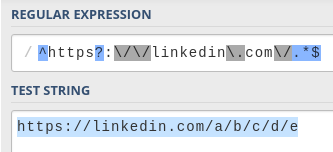

```
^https?:\/\/linkedin\.com\/.*$
```

This pattern allows for any kind of subpath of LinkedIn URLs. It seems pretty much impossible to exploit. The pattern forces the string to start with `https://linkedin.com/` (or `http`, the `s` is optional) literally, with no other option.

However, while I was testing some values on the original page, I noticed that it also allowed subdomains such as `example.linkedin.com` or even `example.sub-domain.linkedin.com`.

I modified my RegExp pattern to reflect this:

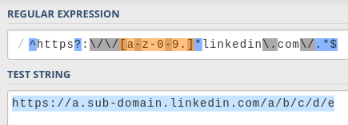

```
^https?:\/\/[-a-z0-9.]*linkedin\.com\/.*$
```

The addition is `[-a-z0-9.]*`, which matches subdomains:

- `[<characters>]` means "match any of these characters".
  - `-`, `a-z` and `0-9` match hyphens, letters, and numbers, which are the allowed characters for a subdomain.
  - `.` matches the dot character, which is the separator for the sub-domain segments.
- `*` means "match between 0 and infinite times".

This makes things more interesting. I started playing with it and quickly found a vulnerability.

## The dot

The `.` character is a must if you want to match a subdomain. If you wanted to support just a single segment (i.e. `subdomain.example.com` and not `sub.dom.ain.example.com`), you could do something like this (shortened for brevity):

```
[-a-z0-9]\.linkedin\.com
```

In this case, because the `.` character is being matched literally (`\.`) along with the rest of the `linkedin.com` domain, and because the "escaping" characters mentioned above (`#`, `?`, etc) are not included in the subdomain expression, there is no room for any exploits.

Of course, this RegExp would **only** allow URLs with a subdomain, so it doesn't make sense anyway.

You could make the dot optional with something like `\.?`, but then you are losing the guarantee that it'll be matched exactly at that position, so you might as well just include the dot inside the square brackets and match it along with the rest of the characters.

This also allows for multiple-segment subdomains (`first-segment.second.third.example.com`). So you can feed two birds with one scone.

That's a win! _Right?_

Well, **no**.

# #1 - The dot exploit

Because you are **not** matching the dot character literally **exactly before the domain** anymore, it could be there... Or not.

You can then have any arbitrary string of characters in any order and, as long as they are included inside the square brackets, there will be a match.

You also don't need to have a dot character in there. The characters between the square brackets just act as sort of a whitelist, which means they are the _allowed_ characters, but you can choose to use them or not.

That means that a URL such as `https://asdflinkedin.com/` is successfully matched.

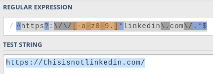

I had found a vulnerability on my own RegExp!

Of course, there was no guarantee that the actual validation RegExp is similar to mine, but I had to try...

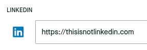

I clicked "save" and...


Nice! It works!

## The payload

With this exploit, I had a way to set a non-LinkedIn URL. The domain, however, had to end with `linkedin.com`. I was hosting my CV on Google Drive, which meant that the URL looked like this: `https://docs.google.com/document/...`.

So how did I point to this document?

Easy. I bought the `notmylinkedin.com` domain, configured it to redirect to my CV, and submitted it on the recruitment platform. Done!

Now every time a recruiter wanted to see my "LinkedIn", they were gracefully redirected to my CV. This was also fun because Google Docs showed me how many people were reading the document in real-time, and I could see the recruiters come and go.

# No LinkedIn? No problem! (act II)

A short while after the first hack, still on my job hunt, I was presented with an application form that was forcing me to submit a LinkedIn profile. Of course, I tried to submit my domain, `notmylinkedin.com`.


However, it was not letting me. This is the error message I got:


Oh, look at that! It showed me the RegExp used for validation. That's convenient.

The first thing I did was copy it into regex101 so that I could play with it.

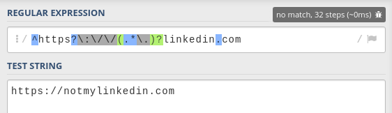

```
^https?:\/\/(.*\.)?linkedin\.com
```

Now, this expression fixes the dot vulnerability that the previous one had. To match potential subdomains, it uses the following expression:

```
(.*\.)?
```

- `(<expression>)?` is an optional capture group, which means that it can either completely match the expression inside, or nothing at all.
- `.*` means "match any character, from 0 to infinite times"
- `\.` means "match the dot character"

This pattern matches anything with the shape `<anything>.`. This way, it makes sure that, if there is any kind of match before the domain, it ends with a dot. This explicitly separates the subdomain from the domain, effectively preventing the previous hack, while still making subdomains optional.

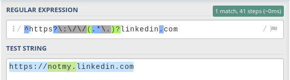

However, because it uses `.*`, it is matching **any** character. The previous one was limited to letters (`a-z`), numbers (`0-9`), hyphens (`-`) and dots (`.`), but this one is not.

> Note: a dot inside square brackets (`[.]`) matches the dot character, while when used elsewhere in the regular expression it matches any character.

# #2 - The escaping exploit

If we can use any character, then maybe we can use one of the "escaping" characters that I had initially attempted to use in the previous hack...

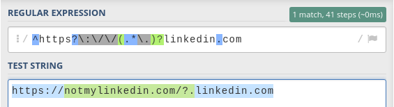

Bingo! Using the `?` character works with this pattern. This is what the address looks like if you enter it in a browser:

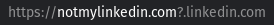

Note how the browser highlights the domain that the URL is pointing to: `notmylinkedin.com`

This trick works because these characters divide URLs into different fragments that serve different purposes. Here are a few examples:

- The `?` character separates the query parameters:

  Example URL: `https://example.com?key=value`

  The query parameters are `key=value`

- The `#` character separates the [anchor ID](https://html.com/anchors-links/):

  Example URL: `https://example.com#section`

  The anchor ID is `section`

- The `/` character separates the pathname:

  Example URL: `https://example.com/path`

  The pathname is `path`

Only one thing left to do. I submitted it... and it worked!

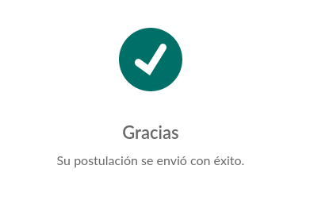

The payload, as you can see, is the same as the one I used with the first exploit. Any subpath would still redirect to my CV, so it works just fine.

# #3 - The subdomain exploit

When I further analyzed this regular expression, I realized that there was yet another vulnerability.

Let's look at the expression again:

```
^https?:\/\/(.*\.)?linkedin\.com
```

Notice how there's nothing after `.com`. This allows us to put anything we want after it.

For instance, we could put `https://linkedin.com.example.com` and it'd still match.

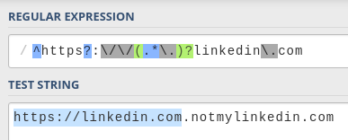

We could use the same payload again by entering `https://linkedin.com.notmylinkedin.com` and it would work as long as I redirect all subdomains to my CV as well.

I didn't get to try this exploit, but it probably would have worked.

# The secure RegExp

The first validation was protected against arbitrary characters in the subdomain, but didn't handle the dot correctly.

The second validation handled the dot correctly but allowed arbitrary characters in the subdomain. Not only that, but it was also vulnerable to the subdomain exploit as well.

Honestly, that is hilarious. It's also pretty harmless, as you can't really do much harm. However, under different circumstances, it could become a serious security problem.

So, how do you protect against all these exploits?

Well, we've already seen separate techniques for the first two:

- Matching the dot literally before the domain (prevents the dot exploit, #1)

  ```
  (\.)?linkedin\.com
  ```

- Matching only allowed subdomain characters (prevents the escaping exploit, #2)

  ```
  [-a-z0-9.]
  ```

We can just combine them:

```
([-a-z0-9.]*\.)?linkedin\.com
```

Additionally, we can add the `/` character at the end to prevent exploit #3 (the subdomain exploit) as well. We could also put this inside of an optional capturing group in case we wanted to allow something like `https://linkedin.com` (without the final `/`), but that's probably never going to be the case anyway.

The full pattern would look like this:

```
^https?:\/\/([-a-z0-9.]*\.)?linkedin\.com\/.*$
```

Let's put it to the test:

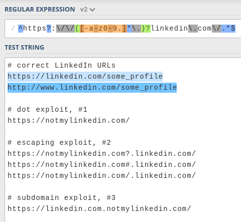

Yay! It works

---

I'm not 100% sure that this RegExp is not vulnerable, but at least it is protected against the three attacks that I have mentioned.

If you still break it somehow, please do let me know!

And remember to secure your regular expressions if you don't want to have someone like me getting past them 😈.
