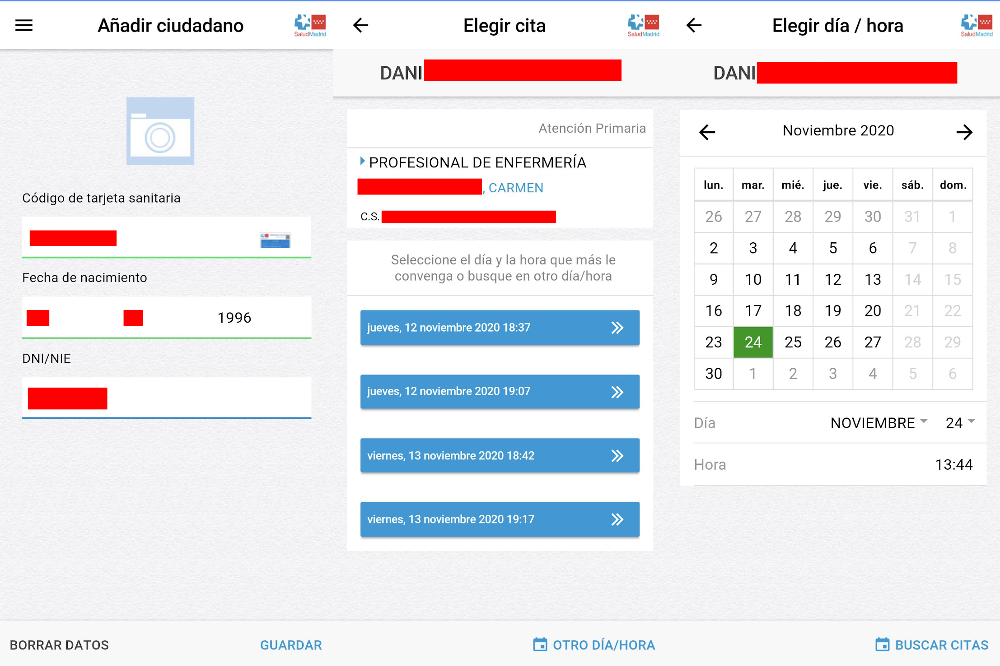
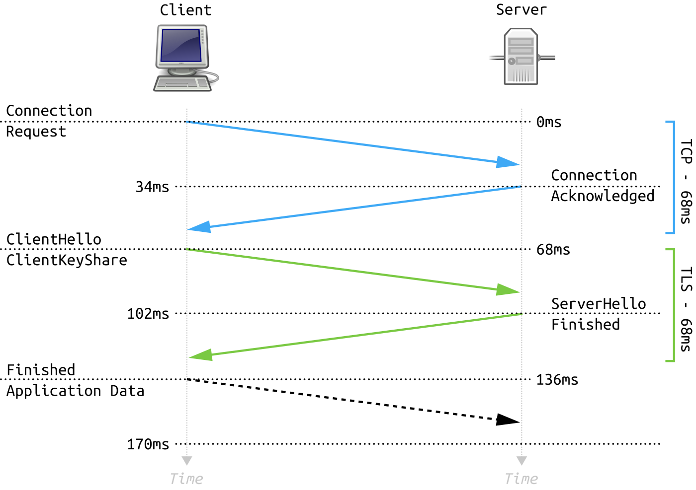
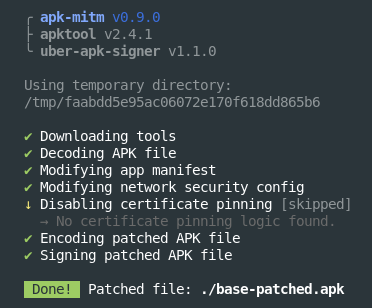
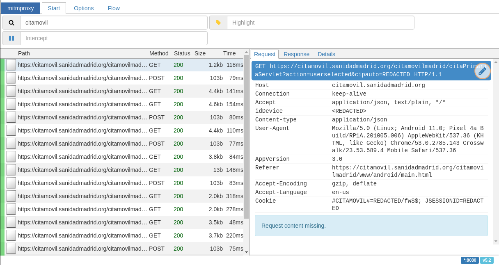
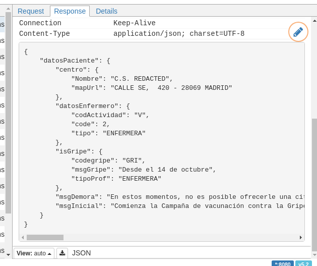

[](https://github.com/DaniGuardiola/saludmadrid-unofficial-cli)


# A bit of backstory

I live in Madrid, Spain.

Here, there is a national healthcare system in place that is public and free (as part of the social security system). It works like this: each person is assigned a GP doctor from a healthcare center next to their residence. When you have a non-urgent medical issue, you schedule an appointment with the GP, which might decide to refer you to a specialist.

To schedule an appointment, you often need to make a phone call, but in Madrid, there's a mobile app that you can use instead: [Cita Sanitaria Madrid](https://play.google.com/store/apps/details?id=org.madrid.citasanitaria).


Now, a while back I had a little accident in which I broke my hand. I had to wear a splint for some time.

When I had the splint removed, it was time for rehabilitation. The Spanish healthcare situation, although much better than in other countries (ahem 👀), it's still far from perfect.

I had to make an appointment with a rehabilitation specialist, but the next available dates were pretty far in time because the system was a bit collapsed at the time.

I was **f\*cked**, wasn't I?

# Coming up with an exploit

Here's a little quirk of the system: some people cancel their appointments. When they do, those slots become available again for a short while, until they get filled.

This gave me an idea for an "exploit". I thought that I could maybe hunt for those cancellations and get an earlier appointment.

Doing it manually is unsustainable though, as those free spots are very scarce and last for a very short time. I would've had to keep reloading the app constantly.

What did I decide to do instead?

- Reverse-engineer the app's backend.
- Create a script that checks for available dates constantly.
- Reschedule my appointment automatically if an earlier date becomes available.

_Definitely_ much less complicated.

[](https://xkcd.com/1319/)

Fortunately, I received a call in which they gave me an earlier appointment just before I was finished with the script, so I didn't really need it anymore.

I was in too deep already though, so I decided to continue anyway. However, I decided to create a CLI interface to make appointments instead of just a script.

Here's how it went.

# Reverse-engineering

## The app and its backend

The app is quite simple. It has a registration screen and a bunch of options to make appointments with different types of healthcare professionals.



It works by communicating with a server through `HTTP` requests.


## The goal

My objective was to create a command-line tool to directly communicate with the server, which exposes the appointment API.

In other words, I wanted to replace the app with the CLI. Same API, different interface.


To achieve this, I first needed to know about the API. I can't make the CLI "talk" to the server if it doesn't speak its "language".

Let's see how we can achieve that.

## Man in the middle

To inspect the requests and responses between the app and the server, we can use a little trick called ["man-in-the-middle"](https://en.wikipedia.org/wiki/Man-in-the-middle_attack). The idea is simple:


With this technique, we're placing a proxy between the app and the server. This will allow us to inspect all requests and responses by essentially forcing all traffic through our proxy.

This is how it works:

1. The app sends a request to the backend server.
2. The proxy intercepts this message, and we can read its contents.
3. The proxy relays the message to the server. The server responds.
4. Once again, the proxy intercepts the message, which we can read as well.
5. The proxy relays the response to the app.

You can also think about it this way:

- The app believes it is talking to the server.
- The server believes it is talking to the app.
- In reality, they are both talking to the proxy, which relays the messages between them.

> This technique is usually employed as an attack, with the purpose of eavesdropping on private communications. Here, however, I am inspecting my own traffic, so no harm is done.
>
> It is completely legal. _Please don't send me to jail._

## TLS 🔒

Things are never that easy.

Turns out that there's a little thing called [TLS](https://en.wikipedia.org/wiki/Transport_Layer_Security), that prevents man-in-the-middle attacks.

TLS is a cryptographic protocol used to encrypt communications between two parties. TLS is used, for example, by your browser, to establish a secure connection to webpages. If you go to a URL that starts with `https` -such as this website-, you are using a TLS-secured connection (the `s` means "secure").

I am not going to delve too deep into the inner workings of TLS because that's beyond the scope of this post (although I recommend you do), but here's a very simplified explanation:

- One party initiates the connection to the other (app -> server, in this case)
- Both parties come up with a shared private encryption/decryption key that only they have knowledge of.
- The parties can now use this key to privately talk to each other:
  - The sender encrypts the message and sends it.
  - The recipient decrypts the message and reads it.

The process of establishing the connection and coming up with the key is called "handshake". Here's an abbreviated version of the [TLS 1.3 handshake](https://en.wikipedia.org/wiki/Transport_Layer_Security#TLS_1.3_handshake) if you're curious:



With TLS, all messages that travel through the network are encrypted and, because the key is only known by both parties, no one else can decrypt them and read them.

You can still intercept the traffic, but you can't make sense of it. Without the cryptographic key, the messages are nothing more than a bunch of ones and zeroes.

## TLS and certificates

There's more to the handshake. You can't just establish a TLS connection with anyone. If that was the case, you could still do a man-in-the-middle by using TLS with both the app and the server.

To make sure that the TLS connection is being established with the intended party, the server needs to prove its identity with a certificate. Again, I'm not gonna explain this topic in detail, but essentially this is how it works:

- The client has a knowledge of which certificates are valid (through trusted root certificates).
- When the server shares its certificate, the client verifies that it is valid using these root certificates.
  - If it is not valid, the client will abort the connection.
  - If is is valid, the handshake will continue and a connection will be established.

This makes a man-in-the-middle attack impossible, because even if you come up with a certificate, the client will reject it.

However, if you have admin access to the client device, you can install the certificate directly, and the client will then trust it. Virtually all man-in-the-middle tools support this, and they provide you with the certificate that you need to install.

## Android and certificates

I was using the Android version of the app. In Android, most apps delegate the handling of certificates to the Android system itself. Installing a certificate on an Android device is very easy and can be achieved through the settings.

There is a problem, though. Apps can restrict the certificates they trust, using mechanisms like [certificate pinning](https://owasp.org/www-community/controls/Certificate_and_Public_Key_Pinning#what-is-pinning) or [the network security configuration](https://developer.android.com/training/articles/security-config).

The app's configuration disallowed user certificates, so it failed to connect to the man-in-the-middle proxy.

Fortunately, there's a way around this. Android apps can be modified by unpacking/disassembling their `apk` (package) files, applying the changes, and re-packing them.

There is a tool called [`apk-mitm`](https://github.com/shroudedcode/apk-mitm) that automatically patches an APK file to circumvent the most common certificate restrictions.

Combined with `adb` (a command-line tool used to communicate with a connected Android device), the process is very simple:

```bash
# find the full name of the installed apk
$ adb shell pm list packages | grep cita
package: org.madrid.citasanitaria
# find the path to the apk
$ adb shell pm path org.madrid.citasanitaria
package:/data/app/...org.madrid.citasanitaria.../base.apk
# download the apk from the device
$ adb pull /data.../base.apk
/data.../base.apk pulled, 0 skipped. 39.0 MB/s (58463709 bytes in 1.429s)
# patch the downloaded apk
$ npx apk-mitm base.apk
Done! Patched file: ./base-patched.apk
# uninstall the original app from the device
$ adb uninstall org.madrid.citasanitaria
Success
# install the patched apk
$ adb install base-patched.apk
Performing Streamed Install
Success
```

If you're curious, this is the output of `apk-mitm`:



Now our man-in-the-middle is successfully running and we can inspect the traffic! 🥳

## Analyzing the API

The tool I decided to use for the man-in-the-middle was [mitmproxy](https://mitmproxy.org/). There are many other tools that do this just as well ([Burp Suite](https://portswigger.net/burp) comes to mind), but mitmproxy is fully [free and open-source](https://github.com/mitmproxy/mitmproxy) anddoes the job perfectly, so I went with it.


This is how the web interface looks like:



Through it, you can see different kinds of data for all requests. Some examples are:

- URL of the request
- Method used (`GET`, `POST`, etc)
- Response code
- Headers
- Size

You can also inspect the full response body:



Using this tool we can collect all relevant information about the API we need to build the CLI.

# Building the CLI

The CLI is fairly simple. If you want to learn all of the implementation details, [check the repo](https://github.com/DaniGuardiola/saludmadrid-unofficial-cli), but here's a simple description:

- **[`lib/api.js`](https://github.com/DaniGuardiola/saludmadrid-unofficial-cli/blob/main/lib/api.js):** wraps all request logic, including a bunch of default headers, response handling and a dirty debug utility.
- **[`lib/cli.js`](https://github.com/DaniGuardiola/saludmadrid-unofficial-cli/blob/main/lib/cli.js):** a bunch of CLI-related utilities: terminal logging, text formatting, date handling and an appointment picker.
- **[`lib/healthcare-user.js`](https://github.com/DaniGuardiola/saludmadrid-unofficial-cli/blob/main/lib/healthcare-user.js):** contains the `HealthcareUser` class, which neatly wraps the API.

  An instance of this class represents a user. All available API operations are exposed as methods such as `login`, `checkAppointments` or `confirmAppointment`.

  It also has methods to export (`dump`) and import (`fromDump`) serialized user credentials, which are used for persistence.

- **[`cli.js`](https://github.com/DaniGuardiola/saludmadrid-unofficial-cli/blob/main/cli.js):** the entrypoint for the CLI. Handles filesystem storage (for credentials persistence), menus and the banner.

# The CLI in action ✨

The banner looks good, huh? 😎


The login process is pretty straightforward.


Profiles are persisted on the filesystem, so you don't have enter your credentials again every time.

The CLI also logs a message with relevant information from the authorities for the user. This message comes from the server.


You can make, reschedule, and cancel appointments easily. The backend is surprisingly fast.

The CLI also shows logs for every important action so you can keep track of them.


---

[](https://github.com/DaniGuardiola/saludmadrid-unofficial-cli)

The source
