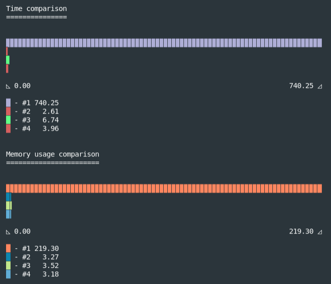
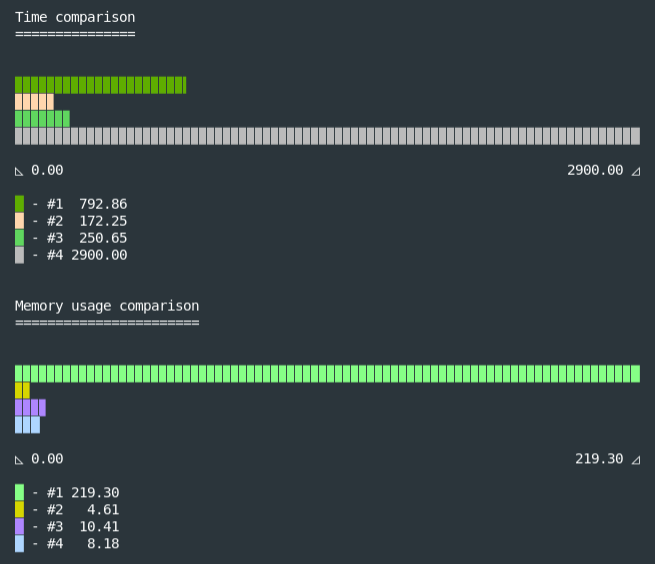
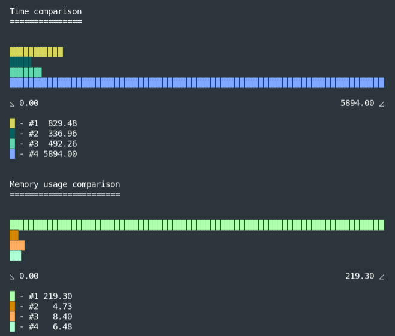
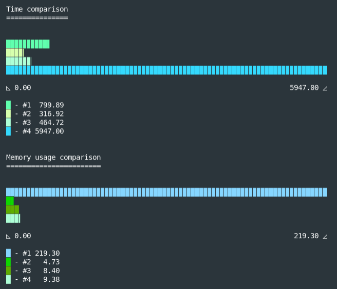

[](https://github.com/DaniGuardiola/node-line-by-line)

# Introduction

This is a small experiment on reading files line-by-line in Node.js (JavaScript), in which I compare the speed and memory footprint of different approaches.

I decided to run this experiment after I was asked to complete a simple code challenge requested by a company for a software engineering position some time ago, but I got carried away and ended up expanding the scope by a lot.

# Goal

The original challenge was to check if a user-provided password is included in [this list of most used passwords](https://github.com/danielmiessler/SecLists/blob/master/Passwords/xato-net-10-million-passwords.txt). The file with the passwords is 46.1 MB big, which makes it difficult to process synchronously. The original challenge already pointed to the right solution: streams.

Streams allow loading data to memory in chunks, instead of having to load the whole file before working with it. This means that the memory footprint of the operation will be roughly the size of the chunk currently being processed, instead of the entire file.

Now, the chunk size, at least in the case of Node.js, is always fixed. That means that every chunk is the same size, no matter the content. The file content, however, is not organized evenly, as every password is on a different line (utf-8 encoding, newlines use the `\n` character) and of different size. This means that what we need is not to read chunk-by-chunk but line-by-line instead, which streams don't support natively.

I have personally dealt with a similar problem before in Python, working with raw TCP connections that sent and received data with custom delimiters (if I remember correctly, TLS transports don't support EOF which complicates things... good times), but I'd never faced it before in Node.js.

Here are 4 different ways to read a big file in Node.js line-by-line.

# Methods

I'm going to explain these methods in an order that makes it easier to understand, but the original order in which I coded them is different (#2, #3, #1 then #4 if you must know).

You can check the full source code in the [`password_checkers.js`](https://github.com/DaniGuardiola/node-line-by-line/blob/master/password_checkers.js) file.

> All benchmarks have been calculated with a decent CPU and a solid-state drive. All tests follow the same format: an asynchronous function that accepts a user password and a stream chunk size, and (asynchronously) returns whether there's been a match or not as a boolean value. The rest of the code is the same for all tests.

## Method #1: loading the whole file 💀

> [Source code](https://github.com/DaniGuardiola/node-line-by-line/blob/master/password_checkers.js#L37)

Self-explanatory. This is what you're not supposed to do. Just load the whole file with [`fs.readFile()`](https://nodejs.org/docs/latest/api/fs.html#fs_fspromises_readfile_path_options), do a massive [`.split(\n)`](https://developer.mozilla.org/en-US/docs/Web/JavaScript/Reference/Global_Objects/String/split) and compare every line until there's a match.

Besides the big memory footprint, this also has the disadvantage of having to process the whole file, loading it into memory byte-per-byte, and then looking for the `\n` character byte-per-byte. That's already two loops. It also means that you have both the full file in memory (in a single string) and the same content but split into multiple strings in an array.

All that memory and time spent, when the password could match the very first line of the file.

### Benchmarks

**Password at line 100:** `taylor`

```
Time spent: 633.99ms
Memory used: 219.20MB
```

**Password at line 2594727 (halfway):** `gint3333`

```
Time spent: 702.419ms
Memory used: 219.20MB
```

**Password at line 5189454 (last one):** `!!!!!!55`

```
Time spent: 728.916ms
Memory used: 219.20MB
```

**Password that doesn't match:** `webjfhvbyuiswhjkej`

```
Time spent: 710.296ms
Memory used: 219.20MB
```

### Conclusion

As you can see, `219.20MB` are loaded into memory every single time. It's not super slow, and stopping the comparisons after a match does shave a few milliseconds when the password is matched early, but as we will see it's not fast compared to other methods.

So just like... don't.

> Note: when memory is not critical, a variation of this method could be a serious contender for speed. The time-expensive task here is loading the file into memory and processing it to split the lines. In a service scenario, for instance, this would be an acceptable initialization time, and the memory consumption could be a good trade-off.
>
> Having all passwords loaded into memory would very likely result in a faster lookup than loading them from the filesystem each time (especially with old hark disk drives).
>
> In fact, depending on the specific circumstances, further optimizations like using a [hash map/table](https://en.wikipedia.org/wiki/Hash_table) or a [trie](https://en.wikipedia.org/wiki/Trie) could make the lookup even faster.

## Method #2: ReadStream

> [Source code](https://github.com/DaniGuardiola/node-line-by-line/blob/master/password_checkers.js#L56)

From now on, we're only going to work with streams. The most straightforward way to obtain a stream for a file is to use the [`fs.createReadStream()`](https://nodejs.org/docs/latest/api/fs.html#fs_fs_createreadstream_path_options) method. This returns a [`fs.ReadStream`](https://nodejs.org/docs/latest/api/fs.html#fs_class_fs_readstream) instance, which is a readable stream.

Then we listen for each chunk with `readStream.on(data, callback)`. Inside the callback, we can split by the `\n` character to obtain the passwords from the current fragment of the file. This comes with a catch, though. Consider the following list:

```
clay pot
lotion
truck
twister
paint brush
washing machine
candle
keyboard
soy sauce packet
playing card
eye liner
sandal
```

A file containing this list as text could have a size of, for example, 130 bytes. Now imagine that our chunk size is of around 42 bytes. The first chunk of the stream could look like this:

```
clay pot
lotion
truck
twister
paint br
```

And the second one:

```
ush
washing machine
candle
keyboard
soy sau
```

See the problem? The last line could not fit the chunk in its entirety. There's an easy solution for this:

```javascript
// simplified, check the source for the full implementation
let previousLastLine = ''
readStream.on('data', data => {
  // get the lines from the chunk
  const currentPwds = data.split('\n')
  // add the last line of the previous chunk
  currentPwds[0] = previousLastLine + currentPwds[0]
  // remove the last line from the current chunk
  // and store it in previousLastLine
  previousLastLine = currentPwds.splice(-1)[0] || ''
  // check this chunks' passwords
  currentPwds.some(checkFn)
})
```

This is fine because if a chunk ends in a newline character (if the last line is not a fragment of a password), splitting it will cause the last element to be an empty string, so when we add it to the next chunk it won't have any effect in the next element:

```javascript
'line 1\nline 2\nline 3\n'.split('\n')
// > ['line 1', 'line 2', 'line 3', '']

'' + 'some text'
// > 'some text'
```

The last detail would be to make sure that we're checking the last line of the last chunk when there are no more chunks to process:

```javascript
readStream.on('end', () => {
  checkFn(previousLastLine)
  // ...
})
```

### Benchmarks

**Password at line 100:** `taylor`

```
Time spent: 2.291ms
Memory used: 3.20MB
```

**Password at line 2594727 (halfway):** `gint3333`

```
Time spent: 176.223ms
Memory used: 3.88MB
```

**Password at line 5189454 (last one):** `!!!!!!55`

```
Time spent: 338.151ms
Memory used: 4.91MB
```

**Password that doesn't match:** `webjfhvbyuiswhjkej`

```
Time spent: 310.896ms
Memory used: 5.56MB
```

### Conclusion

This method is fast and memory-efficient.

Time is linearly proportional to the place of the password in the list, which means that the closer to the top it is, the faster it will be done. This is thanks to the stream, which allows us to progressively process the file and immediately stop once a match is found. The worst time with this method is still about double the best time of method #1 (310.896ms < 633.99ms).

Memory usage is also drastically lower than method #1, as only one chunk is loaded at a time. We reduced it from ~200 MB to ~5 MB. 😎

## Method #3: readline

> [Source code](https://github.com/DaniGuardiola/node-line-by-line/blob/master/password_checkers.js#L89)

Method #2 works just fine, but I often like looking for existing libraries for my projects to avoid having to maintain additional code. Sometimes they're worth it and sometimes they're not. Finding one that can take care of the line-by-line stream would be nice.

Another thing I try to do is to always look for "native" libs from the language or runtime first, be it the standard library from Python or the APIs from the Node.js runtime. It greatly simplifies the codebase and guarantees a very good level of support.

So I found the Node.js [`readline`](https://nodejs.org/api/readline.html) API and implemented it. You pass it a `ReadStream` (like the one we created for method #2) and it provides you with a `line` event that you can listen on with `.on('line', callback)`.

In the callback, we compare the lines with the user password and close the streams (`readline` and `ReadStream`) once we're done. Simple.

### Benchmarks

**Password at line 100:** `taylor`

```
Time spent: 6.021ms
Memory used: 3.60MB
```

**Password at line 2594727 (halfway):** `gint3333`

```
Time spent: 252.007ms
Memory used: 6.99MB
```

**Password at line 5189454 (last one):** `!!!!!!55`

```
> Found (unsafe 🚫)
Time spent: 493.975ms
Memory used: 5.35MB
```

**Password that doesn't match:** `webjfhvbyuiswhjkej`

```
Time spent: 483.533ms
Memory used: 5.11MB
```

### Conclusion

This method is still far more efficient in both compute time and memory usage than method #1, but seems a bit slower and memory-hungrier than method #2. It's more abstract and easier to implement too, and that could be a good trade-off, especially considering how relatively small the difference is.

One thing I noticed is that the `readline` API seems more focused on user interaction than data processing, but that shouldn't stop us from using it this way if it fits our purpose.

## Method #4: line-reader

> [Source code](https://github.com/DaniGuardiola/node-line-by-line/blob/master/password_checkers.js#L117)

Another test I did was with the [`line-reader`](https://www.npmjs.com/package/line-reader) third-party npm module. This module can also take a `ReadStream` and has a straightforward API:

```javascript
// simplified, check the source for the full implementation
lineReader.eachLine(readStream, checkFn)
```

Beautiful. One problem though...

### Benchmarks

**Password at line 100:** `taylor`

```
Time spent: 3.211ms
Memory used: 3.14MB
```

**Password at line 2594727 (halfway):** `gint3333`

```
Time spent: 2.942s
Memory used: 16.07MB
```

**Password at line 5189454 (last one):** `!!!!!!55`

```
Time spent: 5.801s
Memory used: 8.54MB
```

**Password that doesn't match:** `webjfhvbyuiswhjkej`

```
Time spent: 6.049s
Memory used: 10.19MB
```

### Conclusions

The first test is really good, even better than method #3. However, things go downhill _quickly_ (pun intended) from there. Memory usage is great. Time... Not so much.

I don't really know what to make of it. I've looked around the source and I haven't seen any obvious reasons for this bottleneck. The only thing that stood out to me was that instead of consuming the stream via events (`.on('data', callback)`), the library is _pausing_ the stream (causing it to not emit 'data' events) and consuming it via the `.read()` method. I don't know if that could be causing the issue, but I know one thing: 6 full seconds is **not** acceptable. Even method #1 is about 10 times faster.

# Comparisons

Now that we have our contenders, let's do some graphs. I made a script that runs the same password through each of the methods and prints a simple bar chart in the terminal with the results. You can run the tests yourself by cloning the repo and running the `run-all.sh` script.

## Password at line 100



No surprises here. All of them are pretty even except method #1, which is very slow and very memory-consuming.

## Password at line 2594727 (halfway)



Memory usage stays more or less the same, but here `line-read` starts acting up, taking already more than thrice the time than method #1.

Method #2 is a clear winner in both categories.

## Password at line 5189454 (last one)



Not much of a difference. Memory consumption varies in each run, but besides method #1 they remain very similar to each other. Method #2 continues being the fastest and `read-line` keeps slowing down.

## Password that doesn't match



Memory usage stays about the same, method #2 is the fastest once again, and method #4... well...

# Conclusion

Stick to method #2 or #3. Method #3 is more convenient and method #2 is slightly faster, but both are good options.

These tests would be more accurate if they were run multiple times to get averages, but I feel that this is good enough. Especially considering that I could just have just sent the method #2 solution to the code challenge I was originally presented, which would've taken me about 20 minutes instead of a bunch of hours. But I have no regrets, this was fun. Yes, I have a weird definition of fun. Peace out!

---

Try the experiment yourself! Clone the repo and follow the instructions.

[](https://github.com/DaniGuardiola/node-line-by-line)

I'm also considering releasing a package to npm that implements method #2. What do you think?
